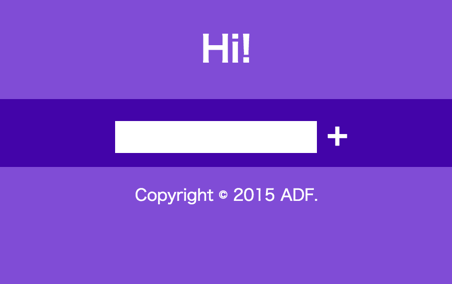
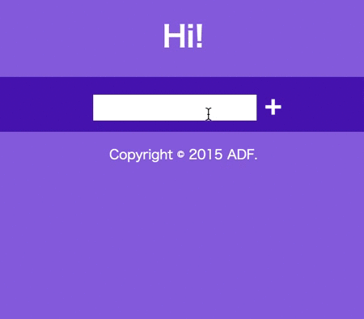
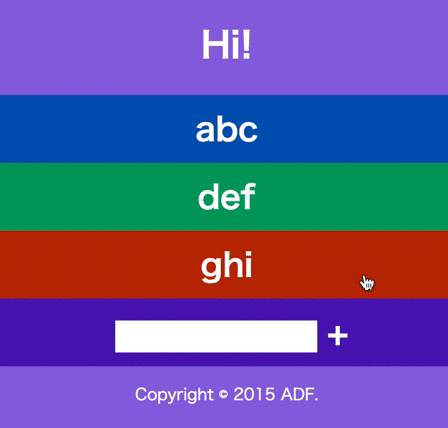

# bugfix-front
Application Developer Festival 2015 バグフィックスチャレンジのフロントエンド問題です.
全体的なルールについては[こちら](https://github.com/ADF2015/bugfix_rule)を参照してください.

## 問題
HTML, CSS, JavaScript ファイルそれぞれ1つから構成される Web ページがある.
この Web ページには幾つものバグがあり以下に記述する仕様どおりに正しく動作しない.
この Web ページの HTML, CSS, JavaScript ファイルを編集して仕様どおりに動くようにせよ.
単に仕様を満たすだけでなく, セキュリティ上の脆弱性が少ないとなお良い.

この Web ページを表示する環境は Google Chrome の最新安定版とする.
それ以外の環境で動作することは特に求められない.

## 解答方法
ソースコードを編集し, 編集箇所に修正した内容 (バグの原因や修正方法)
についてコメントする. 修正したソースコードを提出する.

問題例:
```js
console.l0g("OK");
```

解答例:
```js
// console.l0g と typo していたのを修正
console.log("OK");
```

## 採点方法
想定されているバグについてそれぞれ得点が決められており, 修正したバグの合計点で順位を決める.
合計点が同じの場合は提出時間が早い方を上位とする.

バグを見つけているが修正できていない, 修正が不十分, 修正の仕方が美しくない
(例: 少し修正すればバグがなくなる部分を, 過剰に書き換えている) 場合は,
部分点を与えることがある.

## 提出方法
ファイルを ZIP 形式で圧縮し, Slack の Direct Message を用いて @ymyzk に提出する.

## 仕様
最初に Web ページを開くと下図のようにタイトルと,
ユーザーを追加するテキストボックスとボタン,
フッターが表示される.



ユーザー名をテキストボックスに入力して, 右側の追加ボタンをクリックすると,
ユーザーリストの末尾にユーザー名が追加される.

空文字列や重複するユーザー名は認められない.
この場合, 追加ボタンをクリックしても何も反応しないようにする.

リスト項目の色は, HSL 色空間で色相が 0, 1, 2 ... 359度, 彩度95%, 輝度34%の360色とする.
360色はそれぞれ同じ確率でランダムに選択される.
(ただし Math.random は十分ランダムな値を返すものとする)



ユーザー名のリストから1つの項目をクリックしたとき,
その項目をリストの先頭に移動し, 項目の表示を "Sent Hi!" に変更する.
1秒後に項目の表示をユーザー名に戻す.



## その他
* 不明な点があれば @ymyzk に確認すること.
